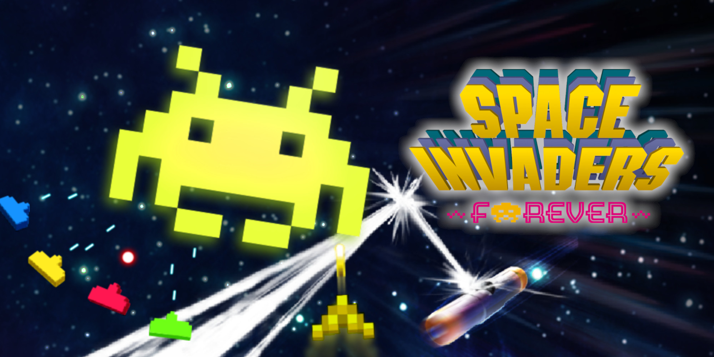
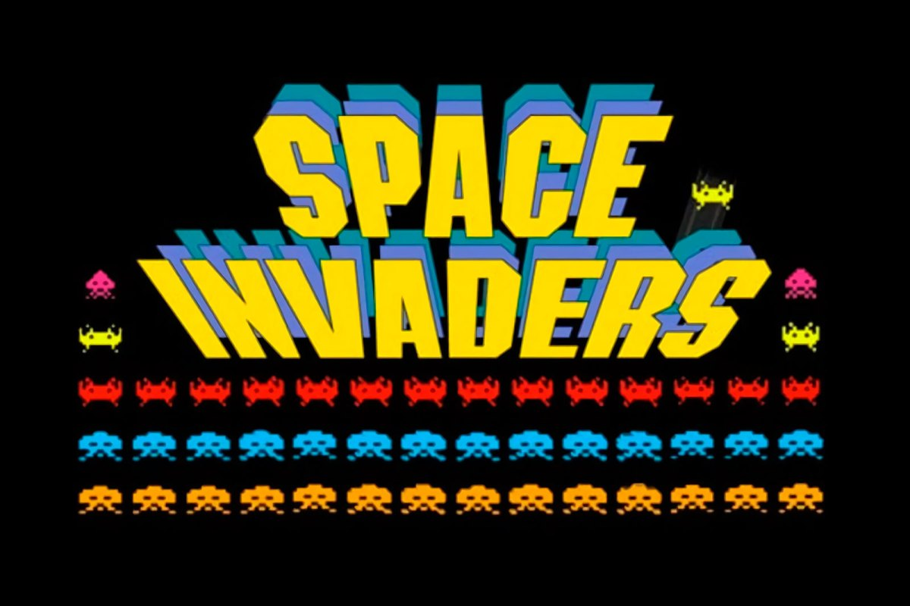

# Space-InCore
Juego ambientado en el mitico Space Invaders

# Enlace al juego
https://s1t0.github.io/Space-InCore/

# Descripcion del juego
Space Incore es un juego ambientado en Space Invaders, la mecanica del juego es la misma, el jugador controla un cañón que puede moverse a la derecha o izquierda y un botón de disparo. Tiene que ir destruyendo los extraterrestres invasores  que van acercándose a la tierra cada vez más rápidamente a medida que el jugador va destruyendo a los enemigos. 

¡¡EVITA QUE LLEGUEN ABAJO Y SALVA AL PLANETA!!

# EJECUCION 

git clone https://github.com/s1t0.github.io/Space-InCore/

cd Space-Incore

npm install

npm init -y

npm run dev

# Librerias
Parcel: para desplegar en servidor nuestro juego  https://parceljs.org/

# Sprites

